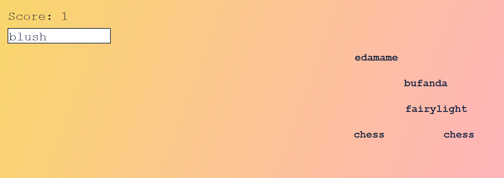

# Typing Game
Typing Game is an interactive Java-based game that challenges players to improve their typing speed and accuracy. Words appear on the screen and move from right to left, and players must type the words correctly before they disappear off-screen.

## How to Run
- Clone the Repository
- Run the pre-built JAR file directly: java -jar TypingGame.jar

